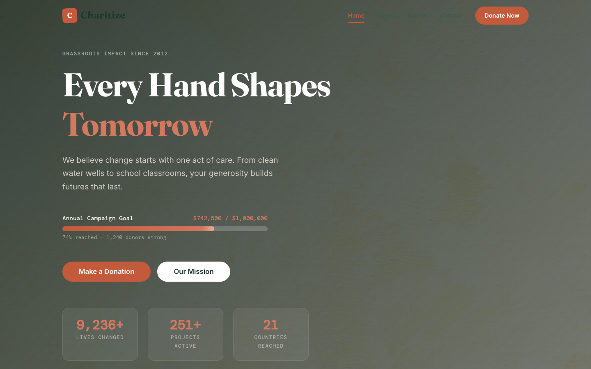

# Charitize — Charity / NGO HTML Template

A premium, framework-free charity website template built with a bespoke organic-warmth design language. Terracotta and forest tones, Fraunces serif headlines, animated donation progress bars, and impact counters that bring grassroots activism to life.

## 📸 Screenshot



## Design Distinction

**Design DNA:** Organic warmth meets grassroots activism. The visual language draws from earthy materials — terracotta soil, forest canopies, sage growth — to communicate trust, urgency, and hope. Every design decision reinforces the charity's mission: the warm palette evokes hands in soil, the Fraunces serif carries weight and sincerity, and the data-driven mono typography (DM Mono) grounds abstract impact in measurable numbers.

**Hero concept:** Full-bleed background image with a live donation progress bar and three animated stat cards — immediately showing visitors that this organization measures results, not promises.

**Signature elements:**
- Animated donation progress bar (74% fill on scroll)
- Impact counters that animate from zero to actual figures
- Cause cards with image overlay transitions
- Story band with floating year badge
- Earthy shadow system (no glossy or glass effects)

**What makes it different:** No generic centered hero with two buttons. No purple gradients. No floating dashboard mockups. The layout flows from data (progress bar) to proof (cause cards) to narrative (story band) to action (events, team, donation CTA). Every section earns its place.

## Pages

| Page | File | Description |
|------|------|-------------|
| Home | [index.html](index.html) | Hero with progress bar, stats, cause cards, story, events, gallery, team, donation CTA |
| About | [about.html](about.html) | Mission, values, timeline, leadership team |
| Events | [events.html](events.html) | Upcoming events, past event highlights, host-an-event CTA |
| Contact | [contact.html](contact.html) | Contact info, form, map placeholder |

## Tech Stack

- **HTML5** — semantic markup, ARIA labels, accessible navigation
- **CSS3** — custom properties (design tokens), CSS Grid, Flexbox, scroll-driven animations via IntersectionObserver
- **Vanilla JavaScript** — no frameworks, no build step, ~3KB gzipped
- **Fonts** — Fraunces (serif display), Inter (body), DM Mono (data/mono)
- **Images** — all original source assets, no placeholder services

## Getting Started

1. Open `index.html` in any modern browser. No server required.
2. All assets are relative — the template works offline.
3. Edit `assets/css/base.css` to customize the design token system (colors, spacing, typography).

## Customization

### Colors
All colors are defined as CSS custom properties in `:root`:

```css
--terracotta: #C45A3C;    /* Primary action/urgency */
--forest: #1B3A2D;        /* Trust/growth */
--sage: #7A9E7E;          /* Hope/nature */
--cream: #FDF8F0;         /* Warmth/canvas */
```

### Typography
Change fonts by updating the `@import` URL and font-family variables:

```css
--font-display: 'Fraunces', Georgia, serif;
--font-body: 'Inter', sans-serif;
--font-mono: 'DM Mono', monospace;
```

### Sections
Each section is a self-contained block. To reorder, cut and paste the `<section>` elements. To remove, delete the block and its associated CSS.

## File Structure

```
charity-html-template/
  index.html
  about.html
  events.html
  contact.html
  README.md
  assets/
    css/
      base.css          # Complete design system
    js/
      main.js           # Interactions & animations
    img/
      about.jpg
      bg.jpg
      bg-footer.jpg
      carousel-1.jpg
      carousel-2.jpg
      donation-1.jpg
      donation-2.jpg
      donation-3.jpg
      event-1.jpg
      event-2.jpg
      event-3.jpg
      gallery-1.jpg
      gallery-2.jpg
      gallery-3.jpg
      gallery-4.jpg
      gallery-5.jpg
      gallery-6.jpg
      team-1.jpg
      team-2.jpg
      team-3.jpg
      testimonial-1.jpg
      testimonial-2.jpg
      testimonial-3.jpg
```

## Accessibility

- Semantic HTML5 landmarks (`<nav>`, `<main>`, `<section>`, `<footer>`)
- ARIA labels on interactive elements
- `prefers-reduced-motion` support — all animations disabled when user prefers reduced motion
- Keyboard-navigable menu with toggle button
- Color contrast ratios meet WCAG AA for all text

## SEO

- Descriptive `<title>` and `<meta name="description">` on every page
- Semantic heading hierarchy (single `<h1>` per page)
- `alt` text on all images
- Open Graph-ready structure

## License

Free for personal and commercial use. Attribution appreciated but not required.

---

**Let's Build Something Together** 🚀
https://tally.so/r/q4q1L9
